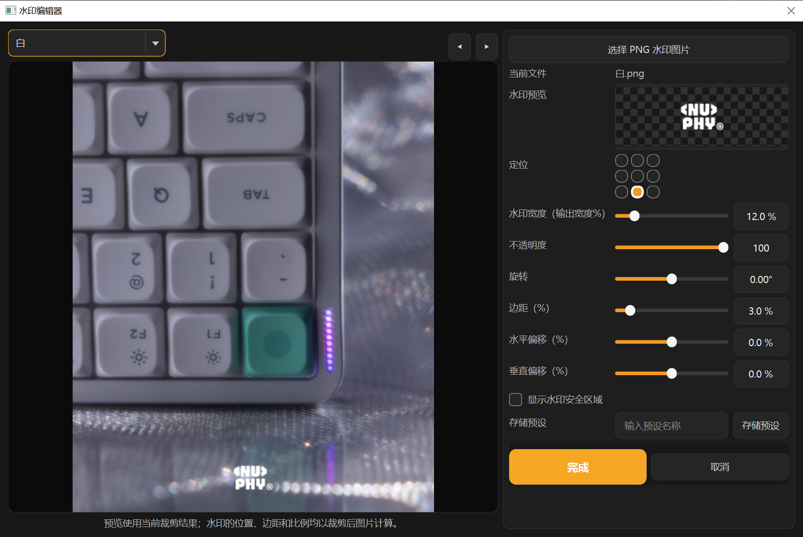

# ImageFlow

ImageFlow 是一款 Windows 桌面应用，将多尺寸裁剪、构图微调、水印、文件命名和批量导出集中在一个工作区中。所有编辑均以参数方式保存，**不会重命名、覆盖或修改导入的原始照片**。

## 界面预览

<p align="center">
  
</p>

<p align="center">
  
</p>

## 基本使用流程

1. 点击“导入照片”，选择需要交付的成片。
2. 在“尺寸设置”中勾选需要的比例，并从“尺寸预览”选择要编辑的尺寸。
3. 在画布中调整构图；在裁剪框内双击可查看裁剪后预览，再次双击或点击顶部“恢复默认构图预览”即可继续编辑。
4. 在“水印设置”“命名设置”“导出设置”中配置输出规则。
5. 点击“一键导出全部”，将所有已选尺寸批量导出。

## 核心功能

- 批量导入 JPG、PNG、WebP、TIFF、BMP 等常用图片格式。
- 内置原图比例、1:1、4:5、3:4、9:16、16:9 等尺寸，支持自定义尺寸。
- 每张图片、每个尺寸独立保存裁剪缩放与位置；支持方向键微调、滚轮缩放、自动居中和三分法辅助线。
- 支持透明 PNG 水印的位置、大小、透明度、旋转、边距与安全区设置；关闭水印后，预览和导出均不显示水印。
- 支持品牌、SKU、颜色、日期、序号等命名规则，可选择保留原文件名或完全覆盖为规则名称。
- 支持 JPG / PNG / WebP 导出、质量设置、ICC/EXIF 选项、按尺寸建立子文件夹和同名保护。
- 支持保存与打开项目文件，保留导入路径和编辑参数；支持水印和命名预设。
- 顶部为单排深色自定义标题栏，Logo、ImageFlow、“管理后台”和窗口控制按钮位于同一排；支持窗口拖动、双击最大化/还原和边缘缩放。“管理后台”可查看并清除预览缓存，以及新增、删除 SKU 和维护其可选颜色；SKU 表格支持双击单元格编辑，点击空白处自动保存并即时刷新命名下拉框。

## 安装教程

### 方式一：使用安装包（推荐）

**支持 Windows 10 1809 及以上、Windows 11（64 位），无需安装 Python。**

1. 下载 [ImageFlow 1.1.0 安装程序（EXE）](https://github.com/remake1026/ImageFlow/raw/refs/heads/master/releases/ImageFlow-1.1.0-Win10-11-Setup.exe)，双击打开中文安装向导。
2. 点击“下一步”，选择安装位置，例如 `D:\软件\ImageFlow`。
3. 选择是否创建**桌面快捷方式**和**开始菜单快捷方式**，首次安装均默认勾选，可以取消。
4. 点击“安装”，完成后可勾选“运行 ImageFlow”，再点击“完成”。

也可下载 [ZIP 版安装包](https://github.com/remake1026/ImageFlow/raw/refs/heads/master/releases/ImageFlow-Installer.zip)，解压后运行其中的 EXE。

> 因安装包尚未进行数字签名，Windows 可能显示安全提示。请确认安装包来自本 GitHub 仓库后，按“更多信息”→“仍要运行”继续。

**更新：** 先退出 ImageFlow，再运行新版安装包，选择原安装目录（包含 `ImageFlow.exe` 的文件夹）。

**卸载：** Windows“设置 → 应用 → ImageFlow → 卸载”，或运行安装目录中的 `Uninstall.exe`。

### 方式二：从源码运行（适合开发或希望自行更新）

1. 安装 [Python 3.11 或更高版本](https://www.python.org/downloads/)。安装时请勾选 **Add Python to PATH**。
2. 下载本仓库的源码 ZIP，或执行：

   ```bat
   git clone https://github.com/remake1026/ImageFlow.git
   ```

3. 进入项目文件夹后，双击 `start.bat`。首次运行会自动安装所需依赖，随后启动 ImageFlow。

也可以使用命令行：

```bat
cd ImageFlow
py -3.11 -m pip install -r requirements.txt
py -3.11 main.py
```

## 开发与打包

项目使用 Python、PySide6、Pillow、PyInstaller 和 [NSIS 3](https://nsis.sourceforge.io/Download)。Windows x64 发行构建采用 Python 3.14，依赖固定在 `installer/requirements-build.txt`，Qt 限制在支持 Windows 10 的版本范围内。

```bat
build.bat
```

也可分步构建：

```bat
py -3.14 -m pip install -r installer/requirements-build.txt
py -3.14 -m PyInstaller --noconfirm --clean "ImageFlow.spec"
py -3.14 installer/build_installer.py
```

> `build*`、`dist*` 与安装临时目录均为可再生成文件，已由 `.gitignore` 排除；`releases/` 内的安装包会被保留并提交到仓库。

输出：`releases/ImageFlow-1.1.0-Win10-11-Setup.exe`、兼容旧下载链接的 `ImageFlow-Installer.zip` 和 `SHA256SUMS.txt`。如 NSIS 不在 PATH，可给构建脚本传入 `--makensis C:\路径\makensis.exe`。静默安装参数见 [安装说明](installer/README.txt)。

## 项目结构

```text
main.py                    主窗口、界面交互与应用流程
app/                       裁剪画布、图像处理、导出与数据模型
resources/                 图标与深色主题样式
products.csv               SKU / 颜色下拉数据
installer/                 发行包安装脚本
releases/                  可下载的安装包
docs/images/               README 配图
```

## 数据与隐私

ImageFlow 在本机处理图片。裁剪、水印和命名均作为编辑参数保存，原始照片不会被修改；导出时仅生成新的输出文件。
