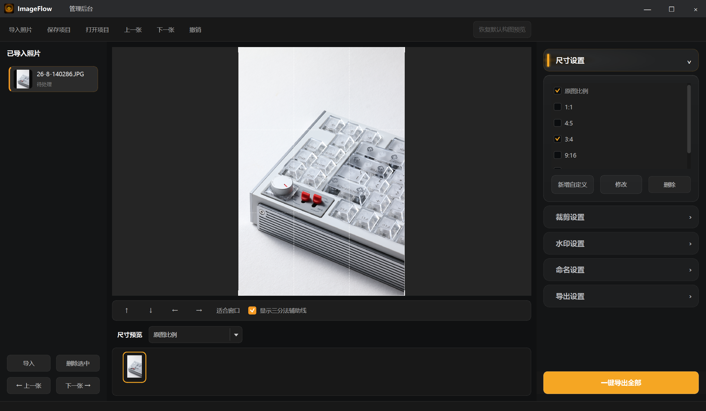

# ImageFlow

> 面向产品图片交付的本地批量裁剪、加水印、命名与导出工具。

ImageFlow 是一款 Windows 桌面应用，将多尺寸裁剪、构图微调、水印、文件命名和批量导出集中在一个工作区中。所有编辑均以参数方式保存，**不会重命名、覆盖或修改导入的原始照片**。

## 界面预览

<p align="center">
  
</p>

## 基本使用流程

1. 点击“导入照片”，选择需要交付的成片。
2. 在“尺寸设置”中勾选需要的比例，并从“尺寸预览”选择要编辑的尺寸。
3. 在画布中调整构图；需要时开启“显示裁剪后预览”确认效果。
4. 在“水印设置”“命名设置”“导出设置”中配置输出规则。
5. 点击“一键导出全部”，将所有已选尺寸批量导出。

## 核心功能

- 批量导入 JPG、PNG、WebP、TIFF、BMP 等常用图片格式。
- 内置原图比例、1:1、4:5、3:4、9:16、16:9 等尺寸，支持自定义尺寸。
- 每张图片、每个尺寸独立保存裁剪缩放与位置；支持方向键微调、滚轮缩放、自动居中和三分法辅助线。
- 支持透明 PNG 水印的位置、大小、透明度、旋转、边距与安全区设置；关闭水印后，预览和导出均不显示水印。
- 支持品牌、SKU、颜色、日期、序号等命名规则，可选择保留原文件名或完全覆盖为规则名称。
- 支持 JPG / PNG / WebP 导出、质量设置、ICC/EXIF 选项、按尺寸建立子文件夹和同名保护。
- 支持保存与打开项目文件，保留导入路径和编辑参数；支持水印和命名预设。

## 安装教程

### 方式一：使用安装包（推荐）

1. 点击直接下载 [安装包（64.8 MB）](https://github.com/remake1026/ImageFlow/raw/refs/heads/master/releases/NuPhy图片交付助手-安装包.zip)。
2. 在下载完成的 ZIP 文件上单击右键，选择“全部提取…”。请先完整解压，**不要在压缩包内直接运行**。
3. 打开解压后的文件夹，双击 `Install.bat`。
4. 在弹出的“选择安装位置”窗口中选择需要安装的磁盘或文件夹，例如 `D:\软件`；安装程序会自动创建应用文件夹。
5. 看到“安装完成”提示后，双击桌面的“NuPhy 图片交付助手”快捷方式即可启动 ImageFlow。

> 因安装包尚未进行数字签名，Windows 可能显示安全提示。请确认安装包来自本 GitHub 仓库后，按“更多信息”→“仍要运行”继续。

**更新已有安装：** 再次运行同一安装包，选择原先的父目录，并在更新提示中选择“是”即可。

### 方式二：从源码运行（适合开发或希望自行更新）

1. 安装 [Python 3.11 或更高版本](https://www.python.org/downloads/)。安装时请勾选 **Add Python to PATH**。
2. 下载本仓库的源码 ZIP，或执行：

   ```bat
   git clone https://github.com/remake1026/ImageFlow.git
   ```

3. 进入项目文件夹后，双击 `start.bat`。首次运行会自动安装所需依赖，随后启动 ImageFlow。

也可以使用命令行：

```bat
cd ImageFlow
py -3.11 -m pip install -r requirements.txt
py -3.11 main.py
```

## 开发与打包

项目使用 Python、PySide6、Pillow 和 PyInstaller。

```bat
build.bat
```

也可使用当前 PyInstaller 配置：

```bat
py -3.11 -m PyInstaller --noconfirm --clean "NuPhy图片交付助手.spec"
```

> `build*`、`dist*` 与安装临时目录均为可再生成文件，已由 `.gitignore` 排除；`releases/` 内的安装包会被保留并提交到仓库。

## 项目结构

```text
main.py                    主窗口、界面交互与应用流程
app/                       裁剪画布、图像处理、导出与数据模型
resources/                 图标与深色主题样式
products.csv               SKU / 颜色下拉数据
installer/                 发行包安装脚本
releases/                  可下载的安装包
docs/images/               README 配图
```

## 数据与隐私

ImageFlow 在本机处理图片。裁剪、水印和命名均作为编辑参数保存，原始照片不会被修改；导出时仅生成新的输出文件。
